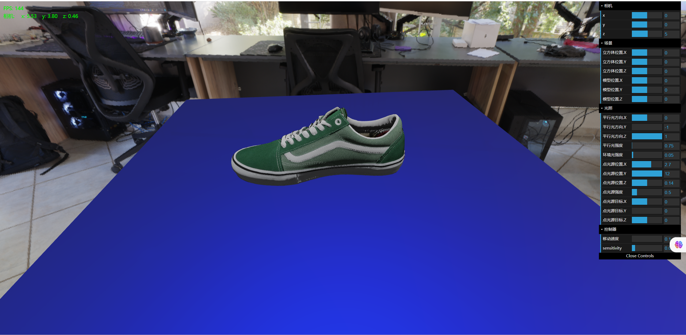

# WebglVue

基于 Vue3+Vite 的WebGL实践项目, 实现了3D引擎的核心功能，仅供学习参考，不建议用于生产环境

## 已实现功能

- [x] 场景管理 (src/scene)
- [x] 渲染器 ([renderer.js](./src/renderer/renderer.js))
- [x] PBR材质
- [x] 灯光
- [x] 阴影计算
- [x] Skybox (天空盒)
- [x] Environment (环境光贴图)
- [x] 控制器 ([controls.js](./src/scene/controls.js))
- [x] (半)透明物体渲染

> 由于本项目主要是为了实践WebGL，所以没有实现模型加载器，采用threejs的GLBLoader来加载顶点数据和材质贴图, 因为解析`.glb`
> 文件有点麻烦，不在本项目的重点范围内

## 渲染效果




## 项目运行

请自行准备一个glb模型文件，放在`public`目录下，然后修改`src/main.js`中的模型加载路径为你的模型文件名

```js
// src/main.js
// 例如: vans_old_skool_green.glb
const model = await loadGlb('vans_old_skool_green.glb')
```

项目启动:

```text
npm install

npm run dev
```

## License

```text
                    GNU GENERAL PUBLIC LICENSE
                       Version 3, 29 June 2007

 Copyright (C) 2007 Free Software Foundation, Inc. <https://fsf.org/>
 Everyone is permitted to copy and distribute verbatim copies
 of this license document, but changing it is not allowed.

```